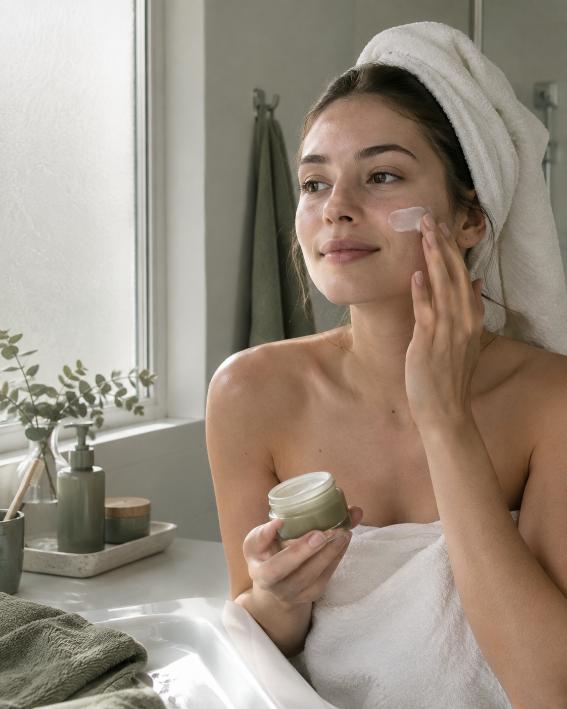

# 🌿 Lumïne — AI-Powered Social Media Strategy

> A complete social media brand strategy built entirely with AI.
> From brand identity to 30 Instagram posts, Reels scripts, and visual prompts.

---

## 🗂️ What's Inside

| File | Description |
|------|-------------|
| `/brand/brand-identity.md` | Brand name, story, values, positioning |
| `/brand/buyer-personas.md` | 2 detailed buyer personas |
| `/brand/brand-voice.md` | Tone, language rules, platform voice |
| `/content/content-pillars.md` | 5 pillars + 20 content themes |
| `/content/content-calendar.md` | 30-day Instagram content calendar |
| `/content/30-posts.md` | 30 captions with CTAs and hashtags |
| `/visuals/image-prompts.md` | Midjourney & DALL-E visual prompts |
| `/reels/scripts.md` | 5 Reels scripts (30–60 sec each) |

---
## 🖼️ Visual Identity

---

## 🌿 About Lumïne

**Lumïne** is a fictional Gen Z skincare brand built on three principles:
- **Transparency** — clean ingredients, honest formulas
- **Simplicity** — skip-care philosophy, fewer products
- **Community** — real skin, real people, no filters

**Price Range:** ₺280–₺650 (Accessible Premium)
**Platforms:** Instagram, TikTok

---

